# SonicRing

## プロジェクト概要

"SonicRing" は、手を使わずに足で演奏できるインタラクティブなピアノ体験を目指したプロジェクトです。2D LiDAR（距離センサーが回転するもの）で足の位置を非接触で検出し、ESP32 がセンサーデータを集約・配信。ブラウザ上のクライアントが点群を可視化し、ドーナツ型に並んだ鍵盤領域を判定して Web Audio API で音を合成します。

必要なハードウェア:
- ESP32
- LD06 LiDAR

### 主な特徴
- **リアルタイム可視化**: 360点の LiDAR 点群を Three.js で 3D レンダリング
- **点群レンダリング（2層）**: 点はアウトラインとコアの2つのレイヤーで描かれ、視認性とグロー効果を両立しています（outline + core）。
- **ドーナツ状鍵盤**: 半円形（カスタマイズ可能）の鍵盤配置
- **純正律音階**: 整数比による美しい和音（Just Intonation）
- **音域シフト**: ±2オクターブの範囲調整が可能
- **WebSocket 自動再接続**: 接続が切れても自動で復旧

---

## システムアーキテクチャ

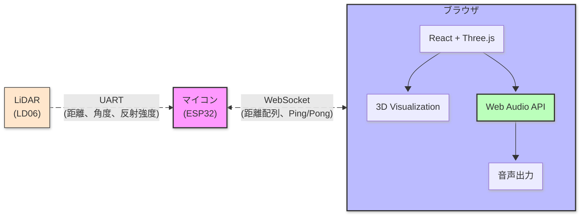

### 処理フロー（1フレーム）

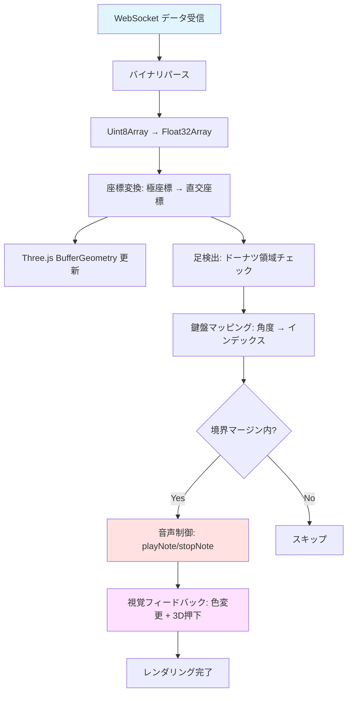

---

## データプロトコル詳細
リトルエンディアン

### LiDAR データパケット構造

全長: 8 + 360×4 = 1448 bytes

| オフセット | サイズ | 型 | 説明 |
|---:|---:|---|---|
| 0 | 1 | uint8_t | type = 0x01 (LiDAR data) |
| 1 | 1 | uint8_t | reserved (0x00) |
| 2 | 2 | uint16_t | point_count (360) |
| 4 | 4 | uint32_t | timestamp (ESP32起動からの経過時間, ms) |
| 8 | 360×4 | float[360] | 距離（meters, float32） 各インデックスは 0..359 (deg) |

クライアントは受信バッファの byte 0..7 をパースして、後続の float 配列を DataView / Float32Array で読み取ります。距離が 0.0 の点は「フィルタ済み（無効）」を意味します。

### Ping/Pong プロトコル（RTT 測定）

```json
// クライアント → サーバー (Ping)
{
  "type": "ping",
  "id": 123,           // シーケンス番号
  "t": 1698765432100   // 送信時刻 (ms, performance.now() ベース)
}

// サーバー → クライアント (Pong)
{
  "type": "ping",      // そのまま返す
  "id": 123,
  "t": 1698765432100
}
```

クライアント（ブラウザ）が 1 秒ごとに ping メッセージ（テキスト）を送信し、ESP32 側は受信したテキストメッセージをそのままエコーして返す実装になっています。ESP32 から自動的に ping を送信するコードはこのサンプルには含まれていません。

サーバー（ESP32）は受け取った同じ文字列をテキストで返すため、クライアントは受信時刻との差分から RTT を計測できます（サンプル UI はクライアント起点の ping を想定しています）。

直近30秒間の RTT 統計（min/max/avg）も計算して表示します。


応答がない場合のタイムアウト処理も実装されています。

## WebSocket コマンド

- THR:<0-255> — 反射強度（confidence）フィルタを更新します。例: `THR:80`。
- それ以外のテキストはエコーされます（ping の応答やデバッグに有用）。

---

## 座標系と角度変換

### 変換アルゴリズム

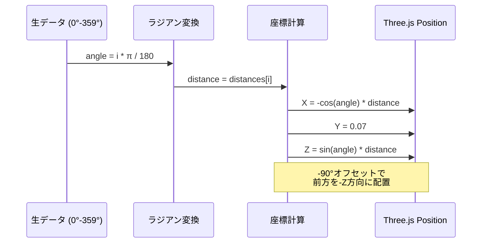

```javascript
// コード内の実装
for (let i = 0; i < 360; i++) {
    const angle = (i * Math.PI) / 180.0;  // ラジアン変換
    const distance = distances[i];

    // Three.js座標系に配置 (LiDARの0°を前方に合わせるため-90°オフセット済み)
    positions[i * 3 + 0] = -Math.cos(angle) * distance;  // X座標 (左右反転)
    positions[i * 3 + 1] = 0.07;                          // Y座標 (鍵盤より上)
    positions[i * 3 + 2] = Math.sin(angle) * distance;   // Z座標
}
```

**重要な調整点**:
- `-Math.cos(angle)`: X軸を反転（Three.js の右手座標系に合わせる）
- `-90°` オフセット: LiDAR の 0° を前方（-Z方向）に配置
- `angleDeg = i - 90` で鍵盤検出時に角度を調整

---

## 足検出アルゴリズム

### 検出の3段階フィルタリング

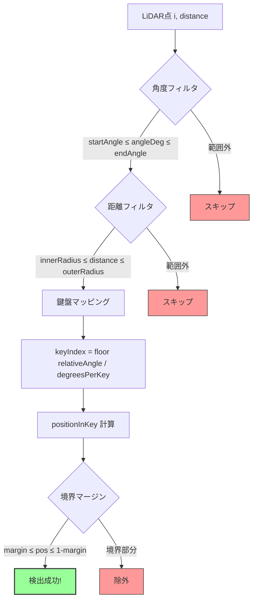

```javascript
// 1. 角度フィルタ: 鍵盤の配置範囲内か？
if (angleDeg >= startAngle && angleDeg <= endAngle) {

    // 2. 距離フィルタ: ドーナツ領域内か？
    if (distance >= innerRadius && distance <= outerRadius) {

        // 3. 鍵盤マッピング: どの鍵盤か？
        const relativeAngle = angleDeg - startAngle;
        const keyIndex = Math.floor(relativeAngle / degreesPerKey);

        // 4. 境界マージン: 鍵盤の境界部分を除外
        const positionInKey = (relativeAngle % degreesPerKey) / degreesPerKey;
        const margin = boundaryMarginRatio / 2;  // デフォルト: 0.2 → 各側0.1

        if (positionInKey >= margin && positionInKey <= (1.0 - margin)) {
            // 検出成功！
            detectedNotes.push(note);
        }
    }
}
```

### パラメータの意味

| パラメータ | デフォルト値 | 説明 |
|-----------|-------------|------|
| `innerRadius` | 0.5 m | ドーナツの内側半径 |
| `outerRadius` | 0.8 m | ドーナツの外側半径 |
| `startAngle` | 120° | 鍵盤配置の開始角度（LiDAR基準-90°） |
| `endAngle` | 240° | 鍵盤配置の終了角度 |
| `boundaryMarginRatio` | 0.2 (20%) | 鍵盤境界の除外割合 |

### 境界マージンの動作

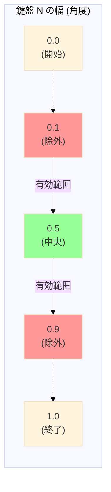

**boundaryMarginRatio = 0.2 (20%) の場合:**
- **除外範囲**: 各側 10% (0.0-0.1 と 0.9-1.0)
- **有効範囲**: 中央 80% (0.1-0.9)

**設計理由**:
- 隣接する鍵盤の境界で誤検出を防ぐ
- 足が鍵盤の端にかかっても安定して検出
- UI で 0% - 50% の範囲で調整可能

### 連打（うなり）抑制

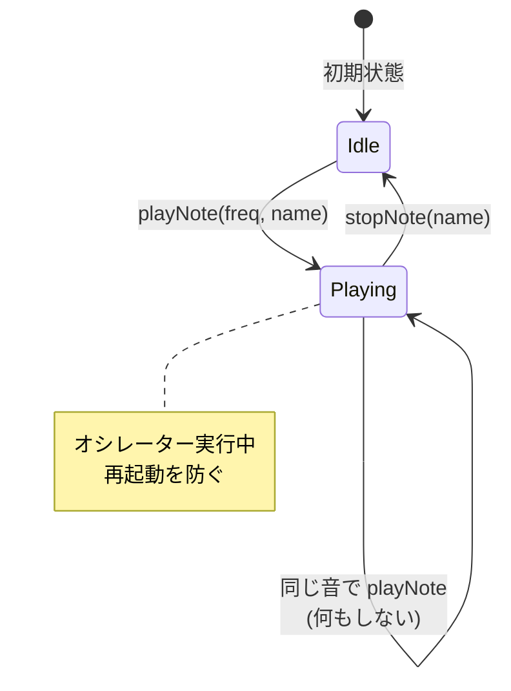

```javascript
// PianoSynth.playNote() の実装
playNote(freq, noteName) {
    if (this.oscillators.has(noteName)) {
        // 既に再生中なら何もしない → 連打を防ぐ
        return;
    }

    // 新規オシレーター作成
    const osc = this.audioContext.createOscillator();
    const gain = this.audioContext.createGain();

    osc.frequency.value = freq;
    gain.gain.setValueAtTime(0, now);
    gain.gain.linearRampToValueAtTime(0.3, now + 0.01);  // アタック

    this.oscillators.set(noteName, { osc, gain, startTime: now });
}
```

**対策ポイント**:
1. 同じ音名が既に再生中なら `playNote` を無視
2. 足が離れて検出から外れたときのみ `stopNote` を呼ぶ
3. これにより「継続的な検出」で音が途切れず、連打音が出ない

---

## 音声合成システム

### 純正律（Just Intonation）の実装

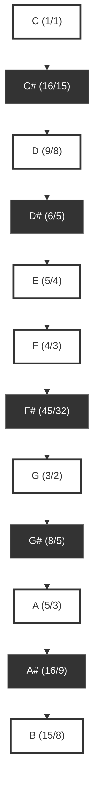

```javascript
// 基本音階定義（C4 = 264 Hz基準）
const BASE_NOTES = [
    { note: 'C',  ratio: 1,      isBlack: false },  // 1/1 (完全1度)
    { note: 'C#', ratio: 16/15,  isBlack: true  },  // 短2度
    { note: 'D',  ratio: 9/8,    isBlack: false },  // 長2度
    { note: 'D#', ratio: 6/5,    isBlack: true  },  // 短3度
    { note: 'E',  ratio: 5/4,    isBlack: false },  // 長3度
    { note: 'F',  ratio: 4/3,    isBlack: false },  // 完全4度
    { note: 'F#', ratio: 45/32,  isBlack: true  },  // 増4度
    { note: 'G',  ratio: 3/2,    isBlack: false },  // 完全5度
    { note: 'G#', ratio: 8/5,    isBlack: true  },  // 短6度
    { note: 'A',  ratio: 5/3,    isBlack: false },  // 長6度
    { note: 'A#', ratio: 16/9,   isBlack: true  },  // 短7度
    { note: 'B',  ratio: 15/8,   isBlack: false },  // 長7度
];
```

### 周波数計算

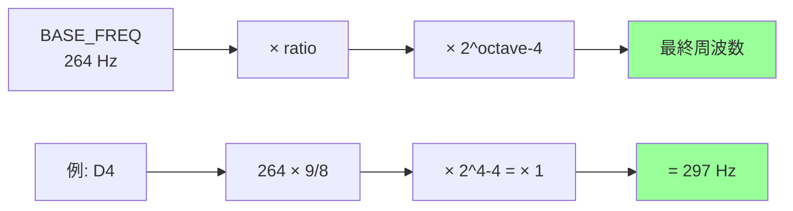

**計算式:**
```
freq = BASE_FREQ × ratio × 2^(octave - 4)

例: D4 の周波数
  = 264 Hz × (9/8) × 2^(4-4)
  = 264 × 1.125 × 1
  = 297 Hz
```

### オクターブシフト

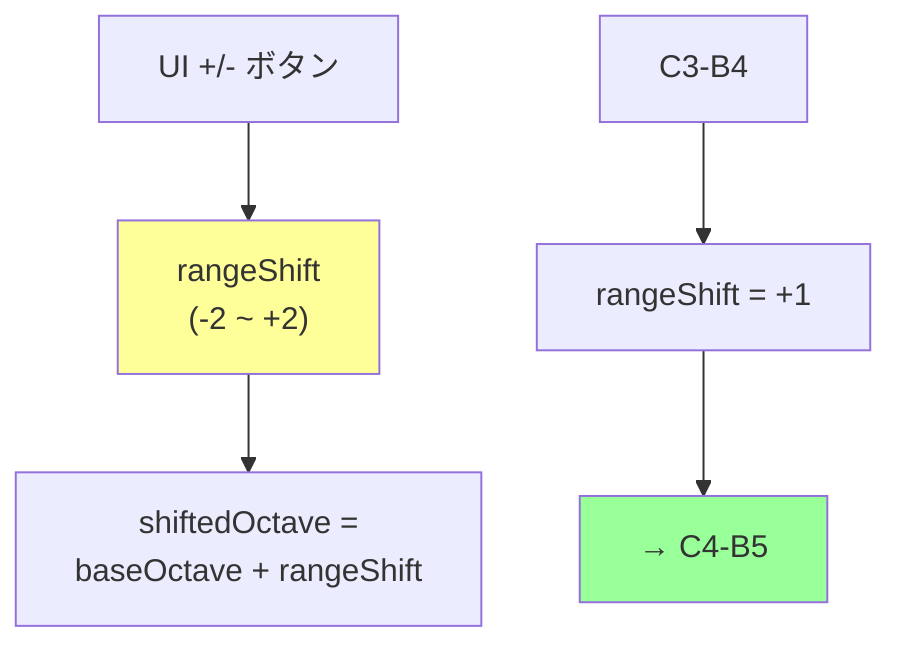

```javascript
// UI の +/- ボタンで rangeShift を変更 (-2 ~ +2)
const shiftedOctave = baseOctave + rangeShift;

// 例: C3-B4 の範囲で rangeShift = +1 の場合
// → C4-B5 の範囲に変換
```

### Web Audio API の構成

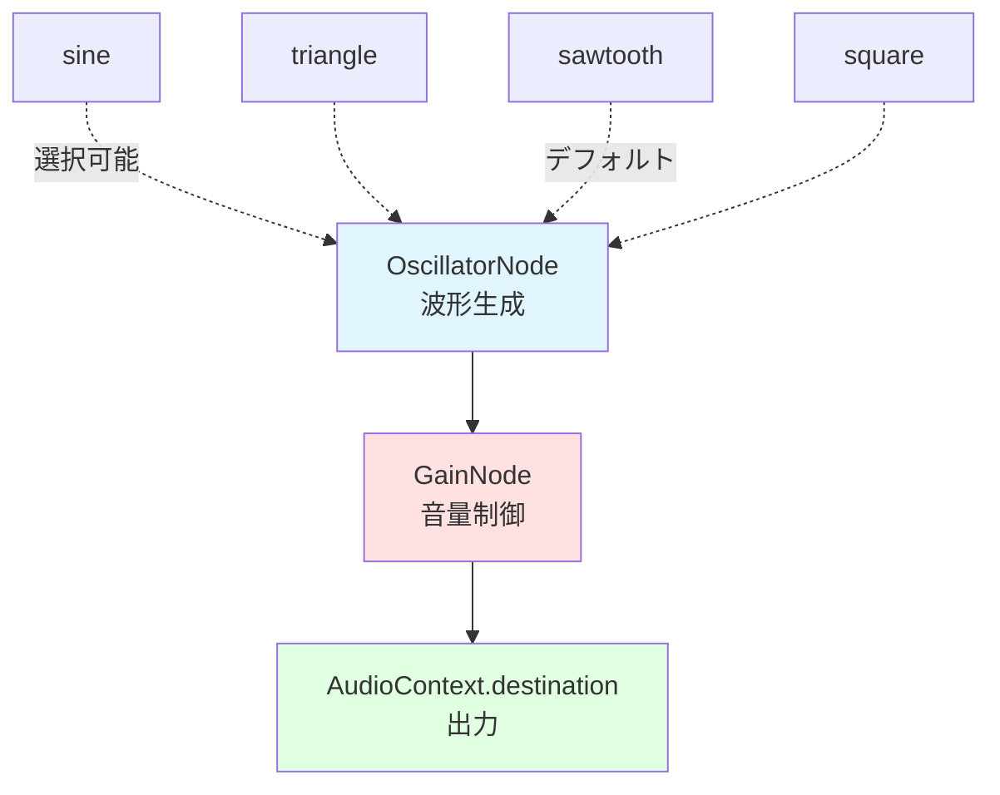

**波形タイプ** (UI で選択可能):
- `sine` (サイン波): 純音、柔らかい
- `triangle` (三角波): やや丸い倍音
- `sawtooth` (ノコギリ波): 豊かな倍音、ピアノに近い（デフォルト）
- `square` (矩形波): 鋭い倍音、オルガン的

**エンベロープ:**

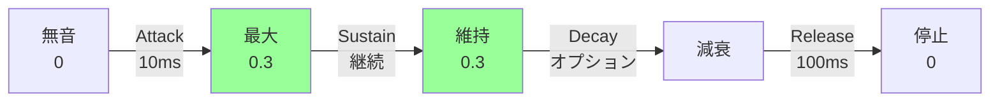

- **Attack**: 0 → 0.3 (10ms の線形ランプ)
- **Decay**: オプション機能で時間経過とともに減衰（減衰ON/OFFで切替可能）
- **Release**: 0.3 → 0 (100ms のフェードアウト)

---

## 3D 鍵盤レンダリング

### ExtrudeGeometry による立体鍵盤

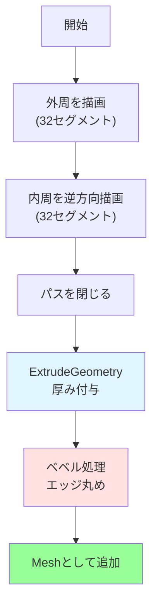

```javascript
// ドーナツセグメントの形状作成
const keyShape = new THREE.Shape();

// 外周を描画（32セグメント)
for (let i = 0; i <= 32; i++) {
    const t = i / 32;
    const angle = startRad + (endRad - startRad) * t;
    const x = Math.cos(angle) * outerRadius;
    const y = Math.sin(angle) * outerRadius;
    if (i === 0) keyShape.moveTo(x, y);
    else keyShape.lineTo(x, y);
}

// 内周を逆方向で描画
for (let i = 32; i >= 0; i--) {
    const t = i / 32;
    const angle = startRad + (endRad - startRad) * t;
    const x = Math.cos(angle) * innerRadius;
    const y = Math.sin(angle) * innerRadius;
    keyShape.lineTo(x, y);
}

keyShape.closePath();

// 厚みを持たせる
const extrudeSettings = {
    depth: note.isBlack ? 0.03 : 0.02,  // 黒鍵は厚め
    bevelEnabled: true,
    bevelThickness: 0.002,
    bevelSize: 0.002,
    bevelSegments: 2
};

const keyGeometry = new THREE.ExtrudeGeometry(keyShape, extrudeSettings);
```

### エッジラインの描画

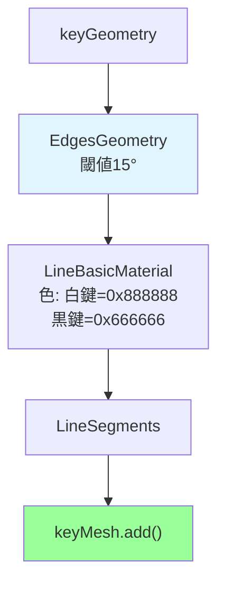

```javascript
// 重要なエッジのみ抽出 (15度以上の角度)
const edgeGeometry = new THREE.EdgesGeometry(keyGeometry, 15);
const edgeMaterial = new THREE.LineBasicMaterial({
    color: note.isBlack ? 0x666666 : 0x888888,
    linewidth: 2  // ※WebGL制限により常に1になる可能性あり
});
const edgeLine = new THREE.LineSegments(edgeGeometry, edgeMaterial);
keyMesh.add(edgeLine);  // 鍵盤の子要素として追加
```

### 押下アニメーション

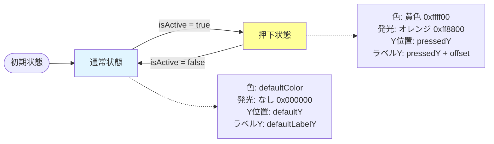

```javascript
if (isActive) {
    // 押されている状態
    keyMesh.material.color.setHex(0xffff00);      // 黄色
    keyMesh.material.emissive.setHex(0xff8800);   // オレンジの発光
    keyMesh.position.y = pressedY;                // 下に移動

    // ラベルも鍵盤に追従
    const labelOffset = defaultLabelY - defaultY;
    label.position.y = pressedY + labelOffset;
} else {
    // デフォルトの状態に復帰
    keyMesh.material.color.setHex(defaultColor);
    keyMesh.material.emissive.setHex(0x000000);
    keyMesh.position.y = defaultY;
    label.position.y = defaultLabelY;
}
```

---

## WebSocket 通信と再接続

### 自動再接続メカニズム

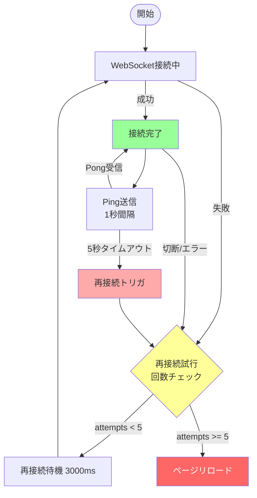

実装上のポイント:

- 再接続の遅延は固定で 3000 ms（3 秒）です。再接続は失敗毎にカウンタを増やし、カウンタが `maxReconnectAttempts`（デフォルト 5）以上になるとページをリロードしてフォールバックします。
- Ping は 1 秒ごとに送信し、Pong が返らない場合は 5 秒（5000 ms）でタイムアウト扱いになり再接続を試みます。

```javascript
// 実装に近い擬似コード（要点のみ）
const connectWebSocket = () => {
    const ws = new WebSocket(url);

    ws.onopen = () => {
        reconnectAttemptsRef.current = 0; // 接続成功でカウンタリセット
        // Ping 送信を開始（1秒間隔）
    };

    ws.onclose = () => {
        // 切断時に再接続をスケジュール
        reconnectAttemptsRef.current++;
        if (reconnectAttemptsRef.current >= maxReconnectAttempts) {
            // 上限に達したらタイマー/オーディオを掃除してページを即リロード
            window.location.reload();
            return;
        }

        const delay = 3000; // 固定 3000ms
        setTimeout(() => connectWebSocket(), delay);
    };
};
```

### Ping タイムアウト監視

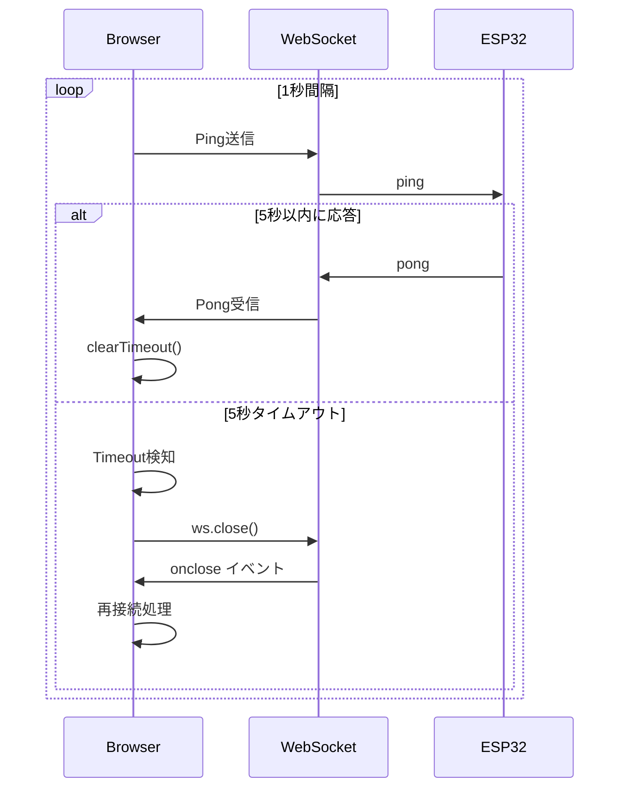

```javascript
    // Ping送信 (1秒間隔)
setInterval(() => {
    ws.send(JSON.stringify({ type: 'ping', id: seq++, t: nowMs() }));

    // 5秒以内に応答がなければ切断
    pingTimeoutRef.current = setTimeout(() => {
        console.warn('Ping timeout - reconnecting...');
        ws.close();  // → onclose で再接続処理が起動
    }, 5000);
}, 1000);

// Pong受信時
ws.onmessage = (event) => {
    if (msg.type === 'ping') {
        clearTimeout(pingTimeoutRef.current);  // タイムアウトキャンセル
        // RTT計算と統計更新
    }
};
```

---

## 実行方法

### インストール

```bash
cd gui
npm install
```

### 開発サーバー起動

```bash
npm run dev
```

→ `http://localhost:****/` でアクセス

### 本番ビルド

```bash
npm run build
```

→ `dist/` ディレクトリに静的ファイルが生成されます

---

## ライセンスとクレジット

### 使用ライブラリ

- **React** (MIT License)
- **Three.js** (MIT License)
- **Vite** (MIT License)

### 参考資料

- [Web Audio API - MDN](https://developer.mozilla.org/en-US/docs/Web/API/Web_Audio_API)
- [Three.js Documentation](https://threejs.org/docs/)
- [Pure Intonation - Wikipedia](https://en.wikipedia.org/wiki/Just_intonation)